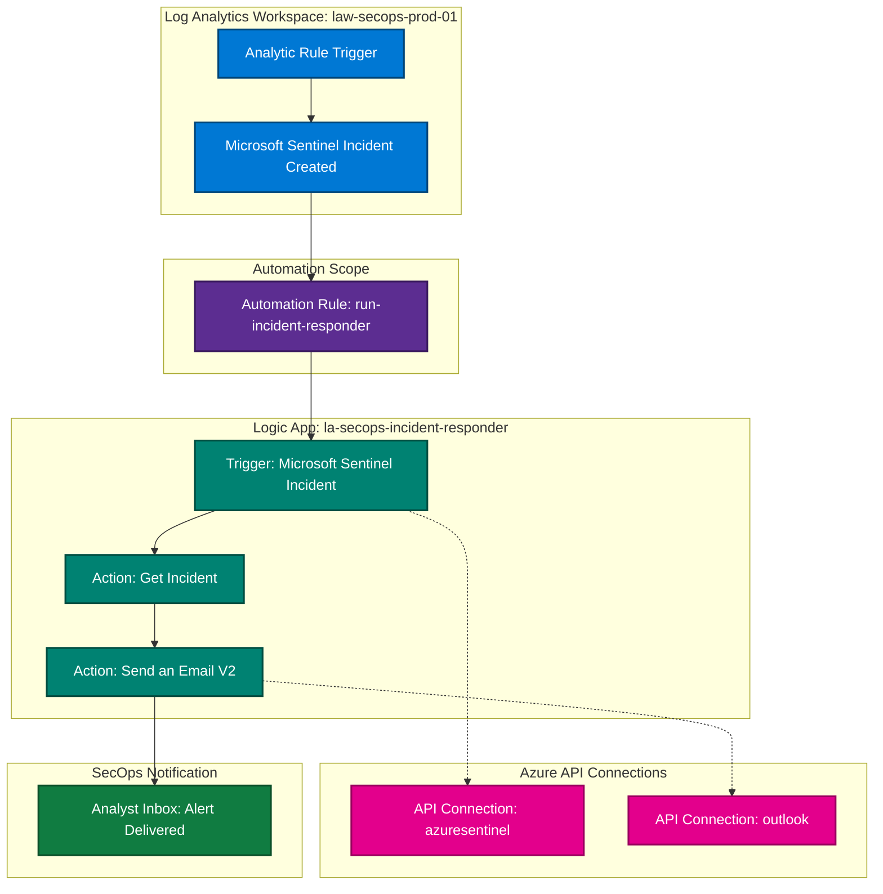

# azure-secops-sentinel-soar-pipeline

Enterprise-grade, Zero Trust-aligned SecOps automation pipeline built as a hands-on lab: event-driven Microsoft Sentinel incident processing, automated Azure Logic App playbook remediation (`la-secops-incident-responder`), FinOps cost governance caps, and REST API payload debugging. Deployed natively using Azure Portal, ARM REST APIs, and JSON playbook definitions.

> **Status:** Operational end-to-end. 
> Bypassed Defender Portal UI redirection loops via ARM REST APIs (`Invoke-AzRestMethod`), forced background scheduler polling (`PUT`), and resolved UI picker abstraction failures via Logic App Code View JSON schema binding (`triggerBody()?['object']?['id']`).

---

## What Works

- **Live Analytic Rule Execution:** Custom analytic rules (`SecOps - Successful Resource Deletion`) and built-in Fusion rules trigger real-time SecOps incidents inside workspace `law-secops-prod-01`.
- **API-First Rule Management:** Bypassed Microsoft Defender portal GUI disconnection loops (`@gmail.com`) by managing analytic rules directly via ARM REST API endpoints (`Microsoft.SecurityInsights/alertRules`).
- **Automated SOAR Dispatch:** Sentinel Automation Rule (`run-incident-responder`) evaluates incident creation events and automatically dispatches execution payloads to Azure Logic App (`la-secops-incident-responder`).
- **Code View Schema Binding:** Logic App workflow parses incoming raw ARM resource paths dynamically via Code View bindings (`triggerBody()?['object']?['id']`), executing a `Get incident` query and dispatching an HTML alert notification via Office 365 Outlook within **2.01 seconds**.
- **FinOps Ingestion Controls:** Strict FinOps ingestion limits (**1 GB/day** cap, **30-day** retention) prevent unexpected log ingestion costs during high-volume testing.

---

## System Architecture & Workflow Diagram



---

## Resource Visualizer & Dependency Map

The diagram below illustrates the active Azure Resource Group (`rg-secops-prod-01`) topology exported via Azure Resource Visualizer, highlighting key solution bindings and API connection dependencies:


---

## Enterprise Governance & Hierarchy


- **CAF Alignment:** Demonstrates enterprise governance by housing centralized operational resources under the dedicated `mg-management` hierarchy under the Platform root.
- **Policy & Governance Scope:** Ensures broad security monitoring policies and Azure Policy assignments applied to the Management group naturally cover `sub-ent-platform-prod`.
- **Resource Isolation:** Keeps core operational logging separate from application workloads (`mg-workloads`) and identity resources (`mg-identity`).

---

## Technical Architecture

```text
+-------------------------+      +--------------------------+      +-------------------------+
|  Microsoft Sentinel     | ---> | Sentinel Automation Rule | ---> |  Azure Logic App        |
|  (Incident Generated)   |      | `run-incident-responder` |      |  `la-secops-responder`  |
+-------------------------+      +--------------------------+      +-------------------------+
                                                                               |
                                                                               v
+-------------------------+      +--------------------------+      +-------------------------+
|  Analyst Email Alert    | <--- |  O365 Outlook Connector  | <--- |  Get Incident Action    |
|  [STATUS: DELIVERED]    |      |  (Send an Email V2)      |      |  (Parsed via ARM ID)    |
+-------------------------+      +--------------------------+      +-------------------------+
```

| Component Category | Resource Name | Purpose / Type |
|---|---|---|
| **Resource Group** | `rg-secops-prod-01` | Centralized SecOps resource scope |
| **Workspace** | `law-secops-prod-01` | Log Analytics & Microsoft Sentinel SIEM instance |
| **Automation Engine** | `run-incident-responder` | Sentinel Automation Rule (*On Incident Creation*) |
| **SOAR Engine** | `la-secops-incident-responder` | Logic App Consumption Playbook (Serverless) |

---

## Execution Phases & Technical Progress

| Phase | Topic | Status | Key Deliverables & Summary Findings |
|---|---|---|---|
| **[Phase 1](docs/phase-1-foundation/README.md)** | Foundation & Control Plane Setup | Done | Provisioned `law-secops-prod-01`, configured 1 GB/day daily caps, 30-day retention, and deployed base Logic App playbook via Bicep/ARM. |
| **[Phase 2](docs/phase-2-automation-rules/README.md)** | Ingestion, CSPM & Automation Rules | Done | Validated `AzureActivity` ingestion, configured Free Tier Defender CSPM, and configured `run-incident-responder` automation rule. |
| **[Phase 3](docs/phase-3-anomaly-diagnostics/README.md)** | Anomaly Identification & API Bypass | Solved | Diagnosed `@gmail.com` Defender portal redirection loops, corrected `ServiceDesk_CL` table errors to `SecurityAlert`, and forced rule polling via ARM REST `PUT`/`GET` calls. |
| **[Phase 4](docs/phase-4-rest-api-pivot/README.md)** | ARM REST API Schema Pivoting | Done | Analyzed raw `/contents/TriggerOutputs` JSON payloads; switched Logic App to Code View and bound `triggerBody()?['object']?['id']` explicitly. |
| **[Phase 5](docs/phase-5-verification/README.md)** | Production Verification & Delivery | Done | Live incident `#9` (`dummm5`) executed successfully in 2.01 seconds with full email delivery. Addressed SPF/DKIM spam filter flags on outbound test messages. |

---

## Technical Specifications & Diagnostic Breakthroughs

### 1. Microsoft Defender Portal Redirection Bug & ARM API Bypass
During rule creation, front-end JavaScript routing in the Azure Portal intercepted personal accounts (`@gmail.com`), forcing them into corporate Entra ID tenant validation loops in Microsoft Defender XDR (`security.microsoft.com`). This caused silent dropouts where custom rules failed to save.

- **Resolution:** Bypassed the browser UI completely by interacting directly with the Azure Management plane using PowerShell (`Invoke-AzRestMethod`) and the ARM API playground.
- **Background Worker Polling Fix:** Executed an explicit ARM REST `PUT` request to update the query definition (`OperationNameValue has "delete"`) and inject the required enablement flags so Sentinel's background worker threads actively poll the rule.

### 2. KQL Table Schema Correction (`ServiceDesk_CL`)
Initial diagnostic queries returned empty datasets or syntax errors because legacy tutorial documentation referenced custom log tables (`ServiceDesk_CL`). 

- **Resolution:** Re-aligned validation queries to native Sentinel schema tables:
  ```kql
  SecurityAlert
  | where TimeGenerated >= ago(24h)
  | project TimeGenerated, AlertName, AlertSeverity, Description, ProviderName
  ```

### 3. Logic App Payload Schema Fix (`HTTP 400 BadRequest`)
The visual designer dynamic content picker passed broken or unparsed object references to the **Get incident** action, causing runtime failure. Inspecting raw REST outputs from `/contents/TriggerOutputs` revealed the true nested JSON structure:

```json
{
  "body": {
    "objectSchemaType": "Incident",
    "objectEventType": "Create",
    "workspaceId": "<REDACTED_WORKSPACE_ID>",
    "object": {
      "id": "/subscriptions/<REDACTED_SUBSCRIPTION_ID>/resourceGroups/rg-secops-prod-01/providers/Microsoft.OperationalInsights/workspaces/law-secops-prod-01/providers/Microsoft.SecurityInsights/Incidents/63883bf7-5be1-42f4-809a-0417943b837b",
      "name": "63883bf7-5be1-42f4-809a-0417943b837b",
      "properties": {
        "title": "dummm5",
        "severity": "High",
        "incidentNumber": 9
      }
    }
  }
}
```

- **Resolution:** Switched to Logic App **Code View** and explicitly bound the parameter to the raw ARM resource path:
  ```text
  triggerBody()?['object']?['id']
  ```

---

## How This Project Evolved

1. **Pivot from Portal GUI to Infrastructure-as-Code & REST APIs:** GUI portal abstractions failed due to tenant context conflicts with personal accounts. The project pivoted to API-first administration using direct ARM REST calls (`Invoke-AzRestMethod` and ARM API playground).
2. **Code View Expression Binding over Visual Designers:** Visual pickers dropped nested JSON attributes; accessing raw JSON definitions directly in Code View ensured precise parameter binding.
3. **FinOps Ingestion Controls Applied:** Applied a hard **1 GB/day** daily cap and a **30-day** retention lifecycle to `law-secops-prod-01` to eliminate unexpected ingestion charges during iterative testing.

---

## Known Limitations & Production Recommendations

- **Unscoped Automation Trigger:** The Automation Rule (`run-incident-responder`) evaluates all incident creation events without severity filters, which would cause notification fatigue in large environments.
- **Personal OAuth API Connection:** The Office 365 connector uses an interactive user OAuth context (`@gmail.com` / personal domain). Production enterprise deployments should use Managed Identities or Azure Communication Services (ACS) with domain SPF/DKIM/DMARC authentication.
- **Stateless Execution:** The playbook currently notifies analysts via email but does not write metadata back to Sentinel (e.g., auto-closing incidents, setting severity, or assigning tags).

---

## Cost Governance (FinOps)

- **SIEM Ingestion:** `law-secops-prod-01` operates under a **1 GB/day hard cap** and **30-day retention**, avoiding unexpected log ingestion or long-term archiving fees.
- **Compute Overhead:** Logic App runs on the serverless **Consumption SKU**, costing $0.00 while idle and billing only per incident execution.

---

## Repository Layout

```text
azure-secops-sentinel-soar-pipeline/
├── README.md                                   (Top-level overview, status, architecture)
├── LICENSE
├── .gitignore
├── docs/
│   ├── phase-1-foundation/README.md            (Workspace, FinOps, base Logic App setup)
│   ├── phase-2-automation-rules/README.md      (Sentinel analytic & automation rule setup)
│   ├── phase-3-anomaly-diagnostics/README.md   (Defender UI bug, ARM PUT/GET, KQL schema fix)
│   ├── phase-4-rest-api-pivot/README.md        (JSON payload tracing & Code View binding)
│   └── phase-5-verification/README.md          (End-to-end execution logs & proof)
├── images/
│   ├── 00-architecture-resource-visualizer.png
│   ├── phase-1/
│   ├── phase-2/
│   ├── phase-3/
│   ├── phase-4/
│   └── phase-5/
├── templates/
│   └── logic-app-responder.json                (Cleaned ARM/Logic App workflow template)
├── scripts/    
   ├── phase-1/
   ├── phase-2/
   ├── phase-3/
   └── phase-4/

```
## Screenshots and Redaction

Subscription IDs, Tenant IDs, user object IDs, and authorization tokens across all evidence screenshots and JSON snippets have been masked or redacted. No credentials or live API keys are committed to this repository.