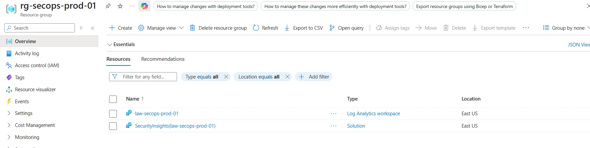
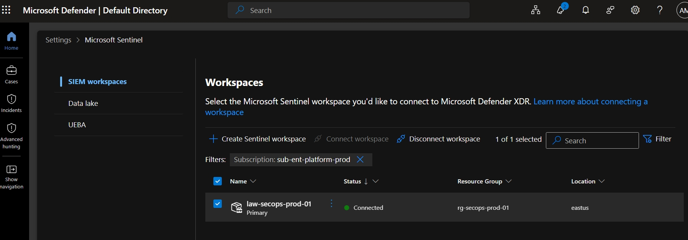
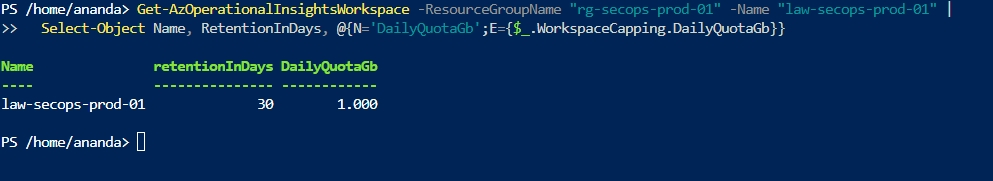
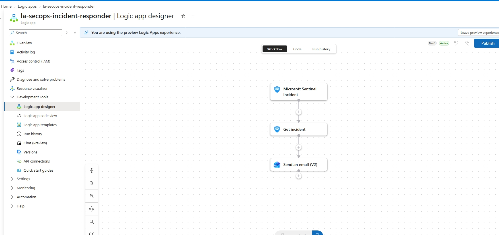

# Phase 1: SecOps Foundation & Control Plane Setup

**Status:** Done. Log Analytics, Microsoft Sentinel SIEM workspace, FinOps ingestion limits, and the baseline serverless Logic App playbook workflow deployed in `East US`.

---

## Scope

- Centralized SecOps resource group (`rg-secops-prod-01`) deployment
- Log Analytics Workspace (`law-secops-prod-01`) provisioned with Microsoft Sentinel onboarding
- FinOps cost governance guardrails (daily ingestion cap & retention lifecycle)
- Base SOAR playbook provisioning (`la-secops-incident-responder`) with API connector links

This phase establishes the underlying control plane and security workspace. It provides the logging engine and workflow runtime necessary before configuring automation rules or payload parsers in subsequent phases.

---

## Architecture Specifications

| Item | Specification / Value |
|---|---|
| **Resource Group** | `rg-secops-prod-01` |
| **Log Analytics Workspace** | `law-secops-prod-01` |
| **SIEM Solution** | Microsoft Sentinel |
| **Logic App Playbook** | `la-secops-incident-responder` (Consumption SKU) |
| **API Connections** | `azuresentinel`, `office365` |
| **Region** | East US |
| **Daily Ingestion Cap** | 1 GB / day |
| **Data Retention** | 30 Days (Active Ingestion Tier) |

---

## Implementation

### 1. Control Plane & Resource Group Provisioning

The resource group `rg-secops-prod-01` was created in `East US` to encapsulate all operational SIEM components, API connectors, and automation engines within a single lifecycle boundary.

### 2. Log Analytics & Microsoft Sentinel Initialization

The workspace `law-secops-prod-01` was deployed, and the Microsoft Sentinel SIEM solution was onboarded onto the workspace control plane.

### 3. FinOps Cost Governance Guardrails

To protect against runaway ingestion charges or diagnostic loop floods during SIEM testing, strict operational controls were enforced on `law-secops-prod-01`:

- **Daily Cap:** Enforced at **1 GB/day**.
- **Data Retention:** Fixed at **30 days** to maximize free-tier/low-cost evaluation allowances.

### 4. Logic App Playbook (`la-secops-incident-responder`) Base Workflow

The consumption-based Logic App workflow was initialized. The initial action chain was constructed:

1. **Trigger:** `Microsoft Sentinel incident`
2. **Action 1:** `Get incident`
3. **Action 2:** `Send an email (V2)`

---

## Verification

| Check | Target / Resource | Result |
|---|---|---|
| Resource Group Status | `rg-secops-prod-01` | Active (`East US`) |
| Sentinel Onboarding | `law-secops-prod-01` | Enabled |
| Ingestion Cap | `law-secops-prod-01` | 1 GB / Day Enforced |
| Retention Period | `law-secops-prod-01` | 30 Days |
| Playbook Deployment | `la-secops-incident-responder` | Provisioned & Connected |

---

## Known Issues & Production Considerations

- **Default Ingestion Cap Alerts:** Reaching the 1 GB daily ingestion cap stops data processing for the remainder of the UTC day. In a production SOC, this cap would be replaced with soft ingestion anomaly alerts rather than hard stop caps.
- **Interactive OAuth API Connections:** The Office 365 connector relies on an interactive user identity context during setup. Production deployments require Service Principals or Managed Identities.

---

## Lessons Learned

- **Enforce FinOps Controls Early:** Setting workspace ingestion limits prior to triggering test analytic rules prevents unexpected billing spikes during trial configurations.
- **Resource Scope Alignment:** Keeping the SIEM workspace, playbooks, and API connections in a unified resource group (`rg-secops-prod-01`) simplifies RBAC role assignments and clean teardowns.