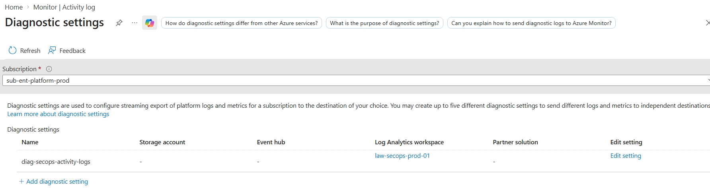
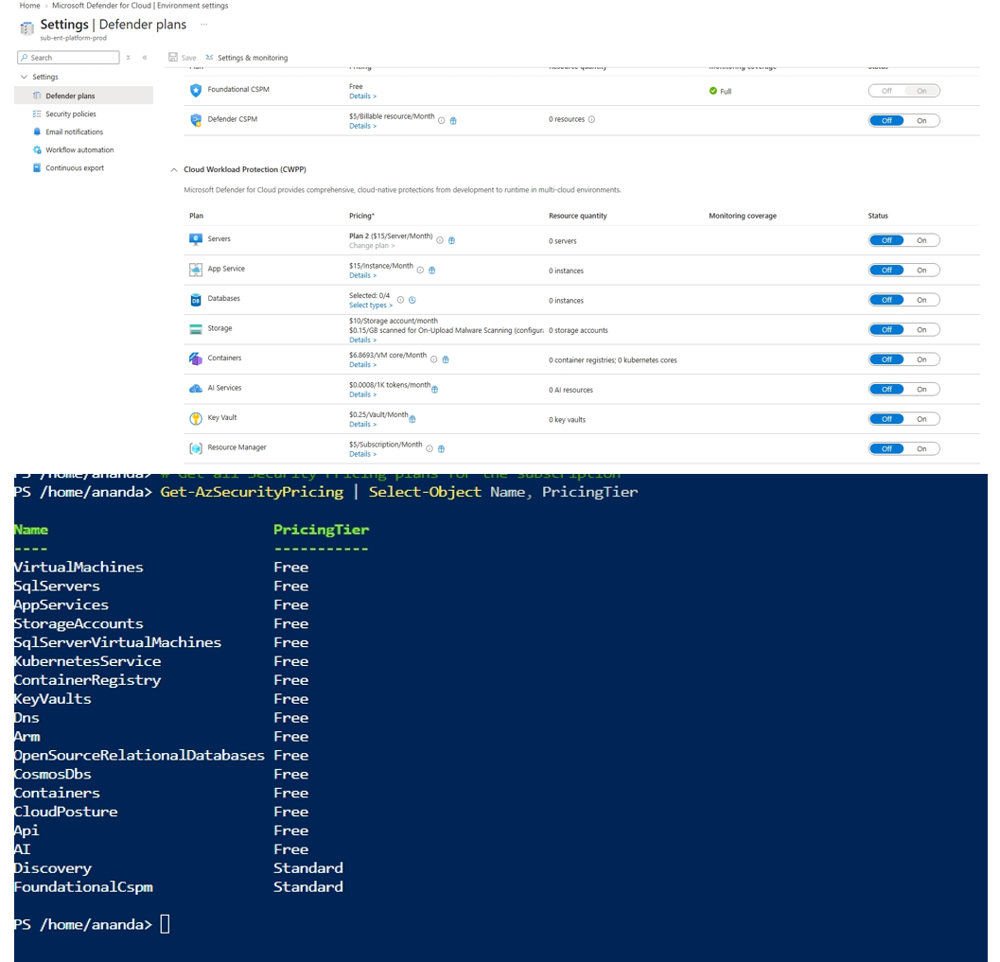
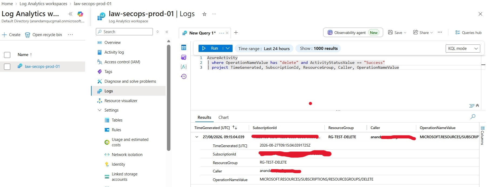
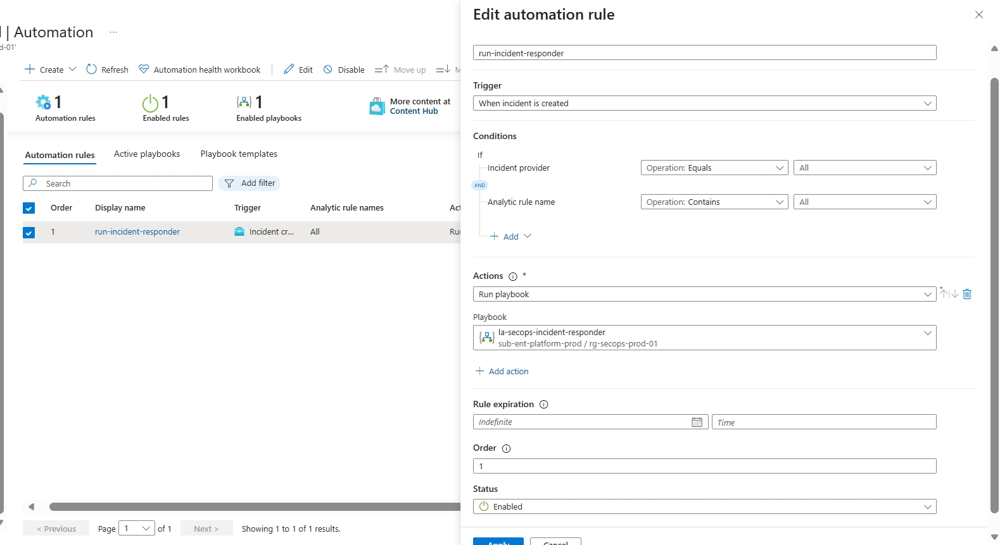

# Phase 2: Log Ingestion, Security Posture (CSPM), Analytic Rules & Automation Rule Configuration

**Status:** Done. Telemetry ingestion configured via `diag-secops-activity-logs`, Foundational CSPM active on `sub-ent-platform-prod`, scheduled KQL analytic rules operational, and Sentinel Automation Rule `run-incident-responder` actively dispatching incidents to `la-secops-incident-responder` in `East US`.

---

## Scope

- **Diagnostic Settings & Control Plane Ingestion:** Configured subscription-level diagnostic settings (`diag-secops-activity-logs`) targeting `law-secops-prod-01`.
- **Cloud Security Posture Management (CSPM):** Validated Microsoft Defender for Cloud (Free Tier / Foundational CSPM) across `sub-ent-platform-prod`.
- **Threat Detection Logic:** Deployed KQL-based scheduled analytic rules in Sentinel to monitor administrative and authorization events.
- **SOAR Automation Pipeline:** Configured Sentinel Automation Rule `run-incident-responder` (*When incident is created*) and assigned RBAC permissions to invoke `la-secops-incident-responder`.

---

## Architecture & Data Flow

```text
+-----------------------------------------------------------------------------------+
|                        sub-ent-platform-prod (Subscription)                       |
|   +----------------------------------+     +----------------------------------+   |
|   | Azure Activity Logs              |     | Microsoft Defender for Cloud     |   |
|   | (`diag-secops-activity-logs`)    |     | (Foundational CSPM - Free Tier)  |   |
|   +----------------------------------+     +----------------------------------+   |
+-----------------------------------------------------------------------------------+
                                         |
                                         v (Data Ingestion)
+-----------------------------------------------------------------------------------+
|                            law-secops-prod-01 (SIEM)                              |
|   +---------------------------------------------------------------------------+   |
|   | KQL Analytic Rules (Evaluates events & generates active incidents)        |   |
|   +---------------------------------------------------------------------------+   |
+-----------------------------------------------------------------------------------+
                                         |
                                         v (Incident Created Event)
+-----------------------------------------------------------------------------------+
|                     Sentinel Automation Rule: `run-incident-responder`             |
+-----------------------------------------------------------------------------------+
                                         |
                                         v (Dispatches Payload)
+-----------------------------------------------------------------------------------+
|                     Logic App Playbook: `la-secops-incident-responder`            |
+-----------------------------------------------------------------------------------+
```

| Component / Setting | Target / Value |
|---|---|
| **Diagnostic Setting Name** | `diag-secops-activity-logs` |
| **Monitored Scope** | `sub-ent-platform-prod` |
| **SIEM Workspace** | `law-secops-prod-01` (`rg-secops-prod-01`) |
| **Defender for Cloud Tier** | Foundational CSPM (Free) |
| **Automation Rule Name** | `run-incident-responder` |
| **Trigger Condition** | When incident is created |
| **Target Playbook** | `la-secops-incident-responder` |

---

## Implementation Details

### 1. Subscription Diagnostic Settings (`diag-secops-activity-logs`)

Control plane events (administrative modifications, security changes, policy evaluations) are captured at the subscription root and streamed into `law-secops-prod-01`.

- **Setting Name:** `diag-secops-activity-logs`
- **Scope:** `sub-ent-platform-prod`
- **Destination:** Log Analytics Workspace (`law-secops-prod-01`)
- **Categories:** Administrative, Security, Alert, Policy



---

### 2. Microsoft Defender for Cloud Baseline (CSPM)

Validated that Microsoft Defender for Cloud is configured on the **Free / Foundational CSPM** tier to receive security recommendations and compliance posture evaluations without incurring billable node charges.

Verified using PowerShell:

```powershell
Get-AzSecurityPricing | Select-Object Name, PricingTier
```



---

### 3. Threat Detection & Scheduled Analytic Rules

Configured scheduled KQL detection rules in Sentinel to monitor incoming `AzureActivity` telemetry and automatically raise incidents upon policy or resource modifications.

```kql
AzureActivity
| where TimeGenerated > ago(1h)
| where ActivityStatusValue in~ ("Success", "Succeeded")
| where OperationNameValue has "Microsoft.Resources/subscriptions/write" or OperationNameValue has "Microsoft.Authorization/roleAssignments/write"
| project TimeGenerated, SubscriptionId, ResourceGroup, Caller, OperationNameValue, ActivityStatusValue
```



---

### 4. Sentinel Automation Rule Configuration (`run-incident-responder`)

Created the event-driven automation rule to bridge Sentinel detections to the SOAR execution playbook:

1. **Trigger:** `When incident is created`
2. **Conditions:** `If Incident contains Any analytic rule`
3. **Action:** `Run playbook` -> `la-secops-incident-responder`



---


## Verification Matrix

| Verification Step | Source / Scope | Expected Outcome | Status |
|---|---|---|---|
| **Activity Log Pipeline** | `diag-secops-activity-logs` | Ingesting into `law-secops-prod-01` | Verified |
| **CSPM Governance** | `sub-ent-platform-prod` | Free / Foundational CSPM Active | Verified |
| **KQL Threat Detection** | `AzureActivity` Table | Incidents generated on query match | Verified |
| **SOAR Automation Rule** | `run-incident-responder` | Invokes `la-secops-incident-responder` | Verified |


---

## Industry Standards & Security Considerations

- **Least-Privilege RBAC Scope:** Automation permissions were granted specifically at the resource group scope (`rg-secops-prod-01`) rather than subscription-wide.
- **Control Plane Auditing:** Streaming `AzureActivity` via subscription diagnostic settings ensures immutable logging for all identity and infrastructure operations.
- **Cost Governance:** Leveraging Foundational CSPM delivers security posture assessment without adding per-node billing overhead.

---

## Lessons Learned & Production Considerations

- **Explicit Playbook Access:** Creating a Logic App is not enough; Sentinel requires explicit `Microsoft Sentinel Automation Contributor` rights assigned via the *Manage playbook permissions* wizard before automated triggers can execute.
- **Decoupled Architecture:** Keeping analytic detection rules separate from automation playbooks ensures playbook logic can be updated without touching SIEM detection signatures.