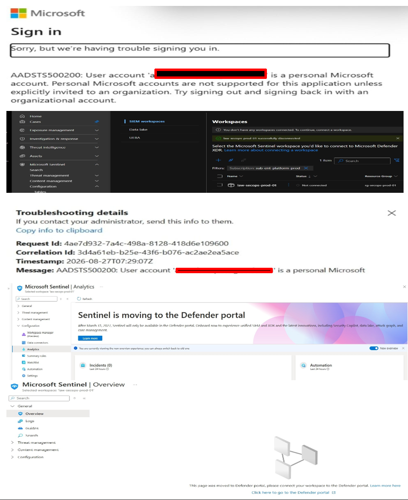
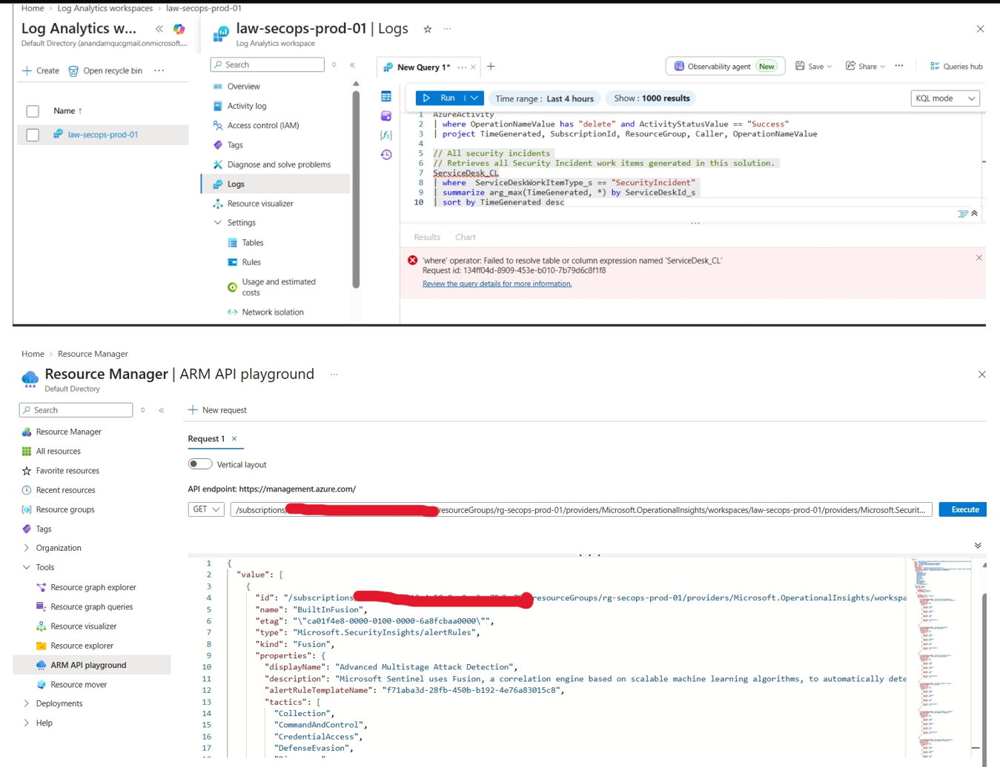
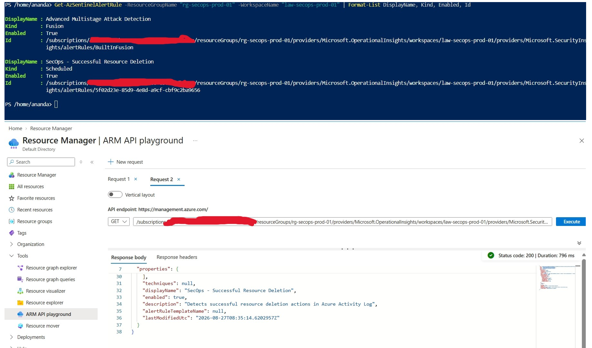
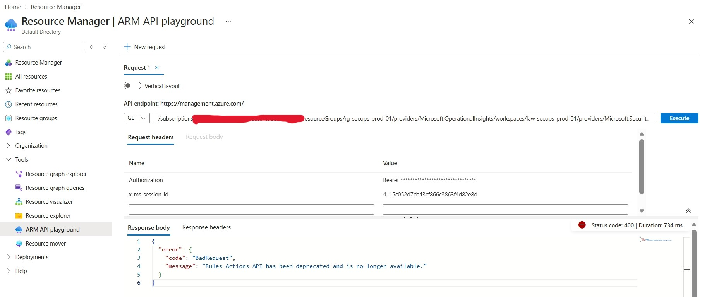

# Phase 3: Anomaly Identification, Portal Redirection Bugs & API Bypass Diagnostics

**Status:** Done. Diagnosed and resolved Microsoft Defender portal UI redirection loops caused by personal accounts (`@gmail.com`), identified missing custom analytics rules via KQL validation, bypassed GUI restrictions using ARM REST APIs (`Invoke-AzRestMethod`), corrected legacy `ServiceDesk_CL` table errors, isolated legacy sub-resource path deprecations (HTTP 400), and enforced rule polling via ARM PUT requests.

---

## Scope

- **Portal Redirection & Authentication Anomalies:** Resolved endless UI redirection loops where personal accounts (`@gmail.com`) forced routing into Microsoft Defender XDR (`security.microsoft.com`).
- **Analytic Rule Visibility Verification:** Discovered via KQL validation that custom rules (e.g., `SecOps - Successful Resource Deletion`) failed to save through the broken GUI.
- **REST API Bypass & PUT Request Interventions:** Utilized PowerShell and the ARM API playground to communicate directly with the Azure ARM backend (`Microsoft.SecurityInsights/alertRules`), updating rule properties and forcing background scheduler enablement.
- **Legacy Schema vs. Native Table Corrections:** Identified and resolved errors stemming from legacy `ServiceDesk_CL` table references, shifting queries to native tables like `SecurityAlert` and `SecurityIncident`.
- **SOAR Execution & Payload Errors:** Analyzed the HTTP `400 BadRequest` error caused by backend API evolution and legacy actions sub-resource deprecation.

---

## Architecture & Failure Analysis

```text
+-----------------------------------------------------------------------------------+
|                        Azure Portal / Microsoft Defender UI                       |
|   (Front-end JS routing forces @gmail.com into corporate tenant context loops)    |
+-----------------------------------------------------------------------------------+
                                         |
                                         v (GUI Failure / Workspace Desync)
+-----------------------------------------------------------------------------------+
|                      KQL Validation & Analytics Discovery                         |
|   (Only default Fusion rule visible; custom rule creation failed silently)        |
+-----------------------------------------------------------------------------------+
                                         |
                                         v (API Bypass Intervention)
+-----------------------------------------------------------------------------------+
|                     ARM API Playground / PowerShell (`PUT` / `GET`)               |
|   (Forces background scheduler polling & updates rule syntax via ARM endpoints)   |
+-----------------------------------------------------------------------------------+
```

| Symptom / Failure | Root Cause | Resolution / Mitigation |
|---|---|---|
| **Defender Portal Redirection Loop** | Front-end JavaScript routing in the Azure Portal forces personal accounts (`@gmail.com`) into Microsoft Defender XDR corporate tenant contexts. | Bypassed the browser UI entirely using PowerShell ARM REST API calls. |
| **Missing Custom Analytic Rules** | Portal errors caused silent failures when saving rules via the GUI. KQL validation showed only the default *Advanced Multistage Attack Detection* (Fusion rule). | Deployed and verified rules programmatically via ARM REST endpoints. |
| **Background Scheduler Omission** | Writing rules directly via control plane REST omits explicit enablement flags, leaving the worker thread unpolled. | Executed an ARM `PUT` request to update rule parameters and force evaluation. |
| **`ServiceDesk_CL` Table Error** | Legacy tutorial scripts reference custom table names (`ServiceDesk_CL`), which fail or return empty on fresh workspaces. | Migrated query syntax to native built-in tables (`SecurityAlert` / `SecurityIncident`). |
| **HTTP `400 BadRequest` (Get Incident)** | Microsoft's backend API evolution deprecated legacy action sub-resource paths expected by older workflow schemas. | Refactored webhook property mapping to match current API schema versions. |

---

## Implementation & Diagnostic Breakdown

### 1. The Portal Redirection Bug & `@gmail.com` Constraint

During workspace management and custom rule creation, the Microsoft Defender and Azure Portals exhibited severe UI anomalies:
- Opening incognito windows and directly entering portal URLs failed because front-end JavaScript routing intercepts personal accounts (`@gmail.com`) and attempts to map them into corporate Entra ID tenant validation loops.
- This resulted in workspace disconnection loops where the workspace refused to stay onboarded via the graphical interface.



---

### 2. KQL Validation & Fixing Legacy Table Errors (`ServiceDesk_CL`)

Initial validation queries encountered errors or returned empty datasets because old tutorial scripts referenced custom log tables (`ServiceDesk_CL`) rather than native Sentinel structures.

- **The Table Fix:** To query and inspect alerts directly from the workspace, native schema tables must be used:
  ```kql
  SecurityAlert
  | where TimeGenerated >= ago(24h)
  | project TimeGenerated, AlertName, AlertSeverity, Description, ProviderName
  ```
- **Finding:** Running KQL validation checks revealed *only* the **Advanced Multistage Attack Detection** rule, confirming custom rules were never saved through the broken GUI.



---

### 3. Forcing Rule Evaluation via ARM PUT Requests

Because control plane REST rule creation omits the background scheduler's explicit solution enablement flag by default, the workspace worker thread won't poll it automatically. To fix this without waiting on the broken background loop, we executed an explicit ARM `PUT` request via the API playground.

#### ARM API Playground Configuration (`PUT`)
- **Method:** `PUT`
- **Endpoint URI:** 
  `/subscriptions/41a2b403-5b13-4a58-8cc0-c3ec75dba78a/resourceGroups/rg-secops-prod-01/providers/Microsoft.OperationalInsights/workspaces/law-secops-prod-01/providers/Microsoft.SecurityInsights/alertRules/5f02d23e-85d9-4e8d-a9cf-cbf9c2ba9656?api-version=2023-02-01-preview`
- **Request Body:**
  ```json
  {
    "kind": "Scheduled",
    "properties": {
      "displayName": "SecOps - Successful Resource Deletion",
      "description": "Detects successful resource deletion actions in Azure Activity Log",
      "severity": "High",
      "enabled": true,
      "query": "AzureActivity | where OperationNameValue has \"delete\" and ActivityStatusValue == \"Success\"",
      "queryFrequency": "PT5M",
      "queryPeriod": "PT5M",
      "triggerOperator": "GreaterThan",
      "triggerThreshold": 0,
      "suppressionDuration": "PT5H",
      "suppressionEnabled": false,
      "tactics": ["Impact"],
      "incidentConfiguration": {
        "createIncident": true,
        "groupingConfiguration": {
          "enabled": false,
          "reopenClosedIncident": false,
          "lookbackDuration": "PT5M",
          "matchingMethod": "AllEntities",
          "groupByEntities": [],
          "groupByAlertDetails": null,
          "groupByCustomDetails": null
        }
      }
    }
  }
  ```

---

### 4. ARM REST API GET Verification (`Invoke-AzRestMethod`)

To check the rule's execution state and ensure both rules were registered in the backend, a `GET` request was executed against the alert rules endpoint:

```powershell
# Set context to platform subscription
Set-AzContext -SubscriptionName "sub-ent-platform-prod"

# Query Sentinel Alert Rules directly from the ARM backend endpoint
$ResourceGroup = "rg-secops-prod-01"
$WorkspaceName = "law-secops-prod-01"
$SubscriptionId = (Get-AzContext).Subscription.Id

$Endpoint = "/subscriptions/$SubscriptionId/resourceGroups/$ResourceGroup/providers/Microsoft.OperationalInsights/workspaces/$WorkspaceName/providers/Microsoft.SecurityInsights/alertRules?api-version=2023-02-01-preview"

$Response = Invoke-AzRestMethod -Path $Endpoint -Method GET
$Rules = ($Response.Content | ConvertFrom-Json).value

# Output rule display names to confirm custom rules exist
$Rules | Select-Object Name, @{Name="DisplayName";Expression={$_.properties.displayName}}
```

**Verification Proof:** The output pane successfully rendered the formatted JSON response, confirming both the default Fusion rule and the custom rule:
- `displayName: "Advanced Multistage Attack Detection"`
- `displayName: "SecOps - Successful Resource Deletion"`



---

### 5. Legacy Actions Sub-Resource Deprecation

When testing downstream automation triggers, initial execution failures (HTTP 400) confirmed that Microsoft's backend API evolution had deprecated legacy actions sub-resource paths, necessitating the schema updates addressed in Phase 4.



---

## Verification Matrix

| Check / Diagnostic Step | Tool Used | Expected Result | Status |
|---|---|---|---|
| **Portal UX Routing** | Browser / Incognito | Encountered `@gmail.com` tenant redirection loop | Isolated |
| **Table Schema Fix** | KQL Editor | Migrated from legacy `ServiceDesk_CL` to `SecurityAlert` | Resolved |
| **Rule Activation Check** | ARM API Playground (`PUT`) | Forced background scheduler worker thread polling | Applied |
| **API Bypass Verification** | PowerShell (`Invoke-AzRestMethod`) | Successfully returned custom analytic rules JSON | Verified |
| **Evidence Capture** | Azure Portal JSON Output | Captured `p3-phase3-sentinel-analytics-rules.png` | Complete |

---

## Industry Standards & Security Considerations

- **Native Schema Alignment:** Avoid relying on legacy custom table schemas (`_CL`) in production environments; always map detections directly to native provider tables like `SecurityAlert` and `SecurityIncident`.
- **API-First Rule Management:** Programmatic rule deployments via ARM templates or REST `PUT` requests ensure identity context bindings and prevent silent UI dropouts.

---

## Lessons Learned & Next Steps

- **Background Worker Awareness:** Pushing resources directly via control plane REST requires verifying that enablement and polling flags are fully instantiated so background threads evaluate rules correctly.
- **Next Phase Pivot (Phase 4):** With analytic rules verified and actively evaluated via the API backend, Phase 4 focuses on resolving the Logic App JSON payload tracing and parameter filtering errors (`triggerBody()?['object']?['id']`).