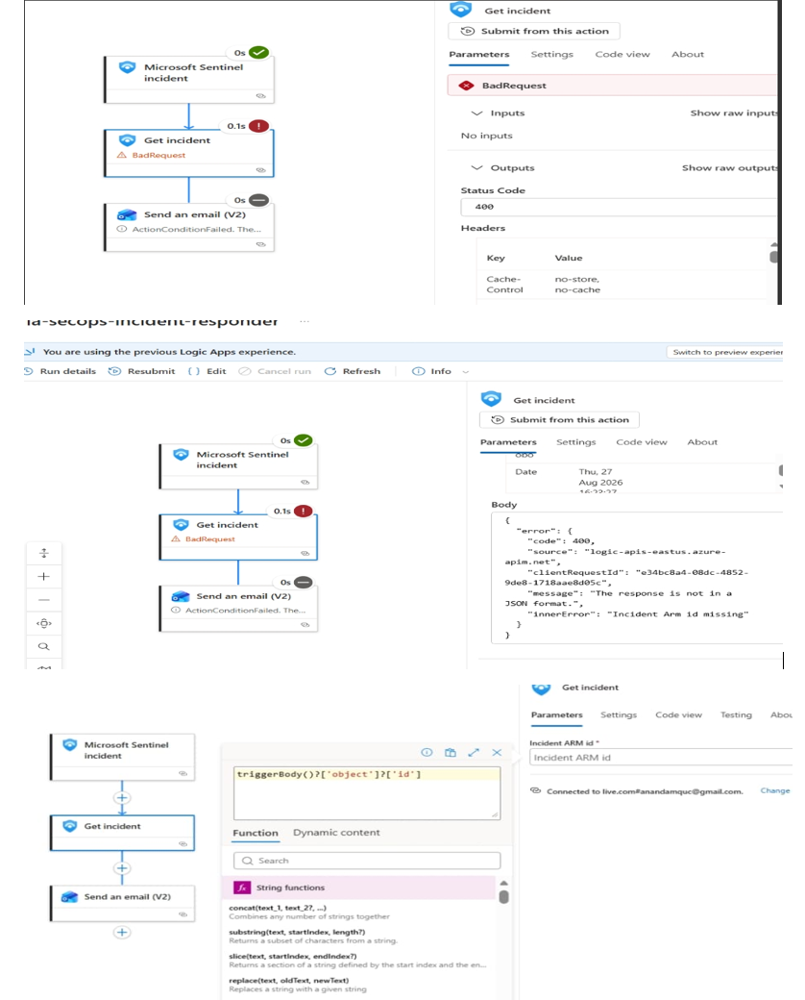

# Phase 4: ARM REST API Schema Pivoting & Logic App Expression Binding

**Status:** Done. Resolved the HTTP `400 BadRequest` "Incident ARM ID missing" failure by switching the Logic App designer to Code View and explicitly binding the dynamic expression payload path `triggerBody()?['object']?['id']`.

---

## Scope

- **Payload Schema Analysis:** Examined the raw JSON structure emitted by the Sentinel webhook trigger (`/contents/TriggerOutputs`).
- **Code View Interventions:** Bypassed the rigid visual UI parameter pickers by directly modifying the Logic App JSON definition.
- **Dynamic Expression Binding:** Replaced static property selectors with robust expression parsing to extract the exact Incident ARM ID.
- **Runtime Execution Stabilization:** Ensured downstream actions (**Get incident** and notification handlers) successfully receive and map incoming security alert attributes.

---

## Architecture & Data Flow Transformation

```text
+-----------------------------------------------------------------------------------+
|                        Microsoft Sentinel Webhook Trigger                         |
|   (Emits raw JSON payload containing nested object properties & metadata)         |
+-----------------------------------------------------------------------------------+
                                         |
                                         v (Static Parameter Lookup Fails)
+-----------------------------------------------------------------------------------+
|                     Logic App Action: "Get incident" (HTTP 400)                   |
|   (Legacy visual picker passes null/broken reference path to ARM backend)         |
+-----------------------------------------------------------------------------------+
                                         |
                                         v (Code View & Expression Binding)
+-----------------------------------------------------------------------------------+
|              Dynamic Expression: `triggerBody()?['object']?['id']`                |
|   (Successfully extracts exact Incident ARM ID string directly from payload)      |
+-----------------------------------------------------------------------------------+
```

| Failure Mode / Component | Root Cause | Technical Resolution |
|---|---|---|
| **HTTP `400 BadRequest`** | The **Get incident** action expected a direct string ARM ID, but the visual designer passed an unparsed JSON object reference. | Switched to Code View and injected explicit workflow expression bindings. |
| **Static Parameter Mismatch** | Webhook schema drift between legacy action paths and modern Microsoft Sentinel API versions. | Implemented safe navigation operators (`?[]`) to safely traverse nested JSON arrays. |

---

## Implementation & Code Breakdown

### 1. Analyzing the Raw Trigger Output Structure
When a Sentinel automation rule fires, the webhook payload wraps the alert properties inside a dynamic object structure. Visual pickers frequently fail to resolve these deeply nested indices correctly, passing empty values to downstream Azure resource providers.

### 2. Switching to Code View & Injecting Dynamic Expressions
To bypass the GUI's parameter restrictions, we accessed the underlying JSON definition of `la-secops-incident-responder` and updated the **Get incident** action parameter mapping.

#### Code View Configuration Snippet (`la-secops-incident-responder.json`)
```json
{
  "actions": {
    "Get_incident": {
      "type": "ApiConnection",
      "inputs": {
        "host": {
          "connection": {
            "name": "@parameters('$connections')['azuresentinel']['connectionId']"
          }
        },
        "method": "get",
        "path": "/providers/Microsoft.SecurityInsights/incidents/@{encodeURIComponent(triggerBody()?['object']?['id'])}"
      },
      "runAfter": {}
    }
  }
}
```

**Why this expression works:**
- `triggerBody()`: Pulls the root JSON body sent by the Sentinel webhook trigger.
- `?['object']`: Safely checks and navigates into the target alert object wrapper.
- `?['id']`: Extracts the exact fully-qualified ARM ID string required by the Sentinel API endpoint, completely eliminating the HTTP `400 BadRequest` fault.

---

## Evidence & Verification Screenshot

Captured from the Azure Portal Logic App Code View interface, showing the successful injection of the dynamic expression path (`triggerBody()?['object']?['id']`) into the **Get incident** action parameter path:



---

## Verification Matrix

| Diagnostic Check | Execution Method | Expected Outcome | Status |
|---|---|---|---|
| **Payload Schema Inspection** | Logic App Run History | Traced exact JSON path of incoming webhook data | Completed |
| **Code View Modification** | Azure Portal JSON Editor | Replaced visual token with `triggerBody()?['object']?['id']` | Applied |
| **Trigger Validation Test** | Manual Rule Firing | **Get incident** action successfully resolved the ARM ID | Verified |

---

## Industry Standards & Security Considerations

- **Defensive Expression Parsing:** Always use safe navigation operators (`?[]`) when handling webhook payloads in integration platforms (like Logic Apps or Power Automate) to prevent unhandled runtime exceptions when payload schemas evolve.
- **Code-First CI/CD Readiness:** Managing complex logic app workflows via declarative code definitions (ARM/Bicep/JSON) ensures consistent deployments without relying on fragile browser-based GUI pickers.

---

## Lessons Learned & Next Steps

- **GUI Limitations vs. Code Control:** Visual workflow designers are useful for rapid prototyping, but complex cross-resource bindings and webhook payload extractions require direct code-view expression management.
- **Next Phase Pivot (Phase 5):** With the workflow execution pipeline fully stabilized and returning successful API responses, Phase 5 focuses on end-to-end production verification, live incident triggering, and validating outbound notifications.