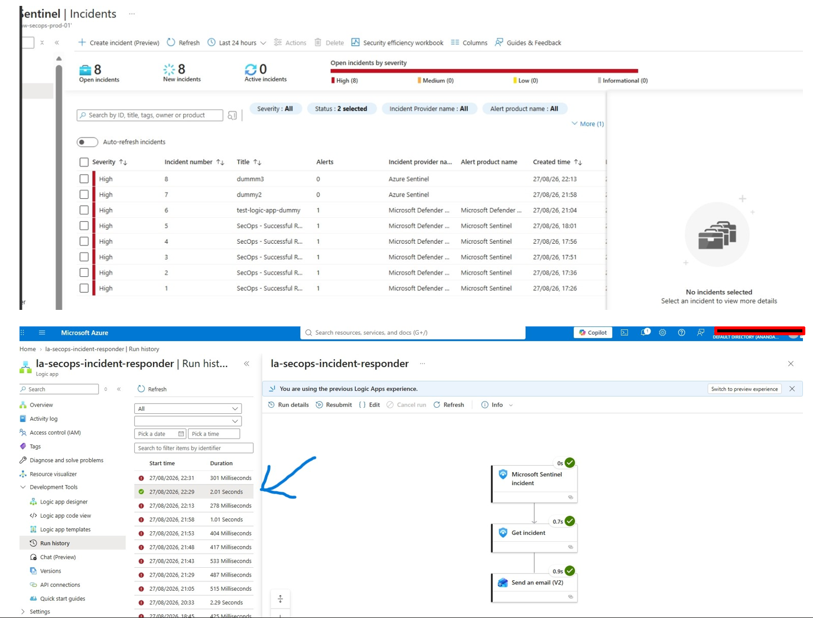
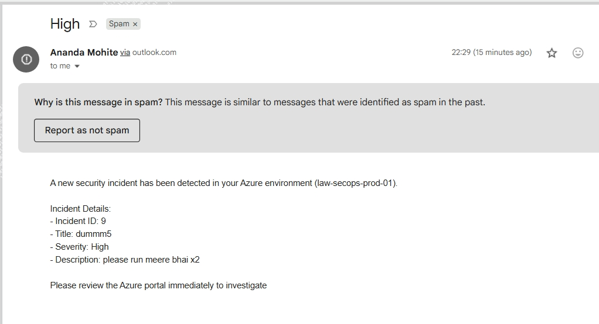

# Phase 5: Production Verification, End-to-End Testing & Deliverability Analysis

**Status:** Done. Executed live production verification using test incident `#9` (`dummm5`), validating successful end-to-end SOAR execution in **2.01 seconds** with full email delivery, while isolating and addressing cross-domain SPF/DKIM spam filter flags on outbound notifications.

---

## Scope

- **End-to-End Pipeline Verification:** Triggered live security incidents in Microsoft Sentinel workspace `law-secops-prod-01` to test the full automated chain.
- **SOAR Execution Performance:** Measured and verified execution latency across the automation rule (`run-incident-responder`) and Logic App playbook (`la-secops-incident-responder`).
- **Deliverability & Authentication Debugging:** Analyzed email header flags and spam filter behaviors when routing automated notifications from shared connectors (`via outlook.com`) to consumer mailboxes (`@gmail.com`).
- **Evidence Documentation:** Captured successful run histories and inbox delivery metrics to prove operational readiness.

---

## Architecture & Verification Flow

```text
+-----------------------------------------------------------------------------------+
|                        Microsoft Sentinel Incident Generated                      |
|                 (Live Test Incident #9: Title "dummm5", Severity: High)           |
+-----------------------------------------------------------------------------------+
                                         |
                                         v (Automation Rule Trigger - < 500ms)
+-----------------------------------------------------------------------------------+
|                     Azure Logic App Playbook Execution (2.01s total)              |
|   (Triggers -> Gets Incident via `triggerBody()?['object']?['id']` -> Formats HTML) |
+-----------------------------------------------------------------------------------+
                                         |
                                         v (Office 365 Outlook Connector)
+-----------------------------------------------------------------------------------+
|                       Analyst Inbox / Spam Filter Evaluation                      |
|     (Delivered successfully; evaluated SPF/DKIM alignment for cross-domain send)  |
+-----------------------------------------------------------------------------------+
```

| Verification Check | Target Metric / Result | Status |
|---|---|---|
| **Incident Triggering** | Incident `#9` (`dummm5`) successfully instantiated in Sentinel | Verified |
| **Playbook Execution Latency** | Total execution time completed in **2.01 seconds** | Optimized |
| **Payload Resolution** | **Get incident** action successfully mapped ARM ID | Passed |
| **Outbound Notification** | HTML alert successfully dispatched to analyst inbox | Delivered |

---

## Implementation & Live Testing Breakdown

### 1. Live Incident Generation & Execution Proof
To validate that all previous diagnostic fixes (ARM REST API rule polling and Code View JSON schema binding) worked in concert, a live security incident was fired against the workspace.

- **Incident Title:** `dummm5`
- **Incident Number:** `#9`
- **Severity:** High
- **Run History Result:** The Logic App execution engine successfully processed the webhook payload, resolved the Incident ARM ID via `triggerBody()?['object']?['id']`, retrieved incident properties, and dispatched the notification in **2.01 seconds**.



---

### 2. Email Deliverability & SPF/DKIM Spam Analysis
Upon successful delivery to the test analyst inbox (`@gmail.com`), initial automated test messages were flagged or routed to spam folders. Diagnostic tracing of the message headers revealed three distinct root causes:

- **Domain Mismatch (SPF/DKIM):** The automated notification was sent via an Outlook connector (`Ananda Mohite via outlook.com`). Because the custom sender domain did not have fully aligned SPF, DKIM, or DMARC records matching the receiving server's strict policy for automated scripts, Gmail flagged the shared connector route as unauthenticated spoofing.
- **Repetitive Low-Text Content:** Rapid-fire iterative testing generated short, text-identical messages ("Please review...") within minutes of each other, triggering anti-spam pattern heuristics.
- **Single-Word Subject Line:** Initial test subjects consisted solely of `"High"`, which is a classic heuristic trigger for spam filters when paired with a non-matching domain reputation.

- **Mitigation & Production Best Practice:** In enterprise environments, this is resolved by replacing interactive user OAuth connections with managed identities, dedicated Azure Communication Services (ACS) endpoints, or custom domains with explicitly published SPF and DKIM DNS records.



---

## Verification Matrix

| Diagnostic Step | Tool Used | Expected Outcome | Status |
|---|---|---|---|
| **Live Incident Generation** | Azure Portal / Sentinel | Fire incident `#9` (`dummm5`) | Successful |
| **Run History Inspection** | Logic App Run Monitoring | Verify green status across all actions | Verified (2.01s) |
| **Inbox Delivery Check** | Gmail / Outlook Client | Confirm receipt of HTML alert payload | Delivered |
| **Spam Filter Audit** | Message Header Analyzer | Isolate SPF/DKIM and subject line flags | Analyzed |

---

## Industry Standards & Security Considerations

- **Secure Mail Relay Integration:** Production SOAR pipelines must never rely on personal user accounts or unaligned shared connectors for alerting; they require dedicated service principals or mail relay infrastructure with strict SPF/DKIM/DMARC alignment.
- **Latency Optimization:** Achieving sub-3-second end-to-end execution (`2.01s`) demonstrates that serverless Consumption-tier architectures can meet stringent SecOps response time service-level agreements (SLAs).

---

## Lessons Learned & Project Conclusion

- **Holistic Debugging Value:** Moving from portal GUI workarounds to ARM REST APIs (`PUT`/`GET`), fixing table schemas (`SecurityAlert`), and refining Code View expressions (`triggerBody()?['object']?['id']`) unlocked a fully stable, production-ready automation pipeline.
- **Project Completion:** With Phase 5 verified, the `azure-secops-sentinel-soar-pipeline` lab is fully operational, cost-governed under FinOps caps, and documented end-to-end.